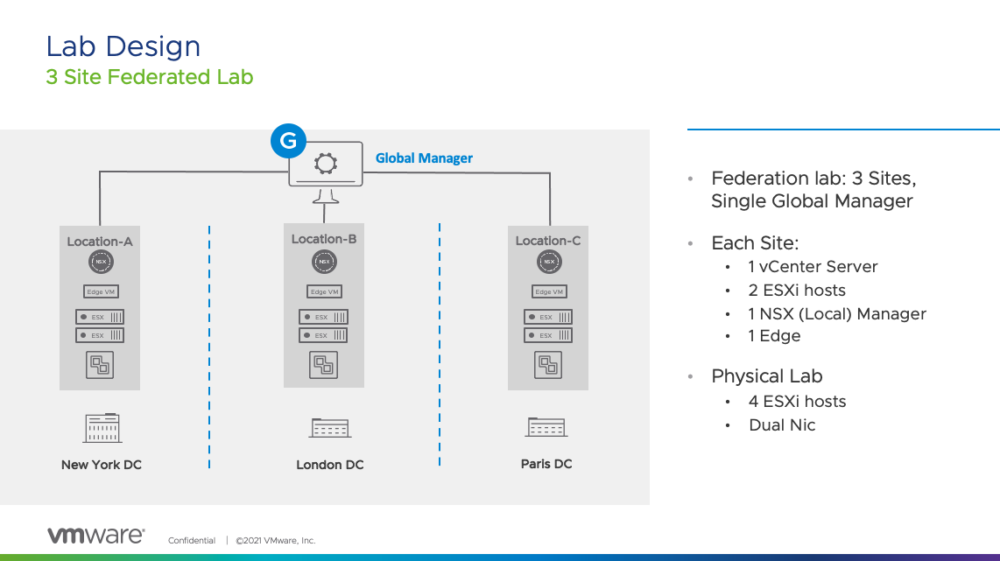
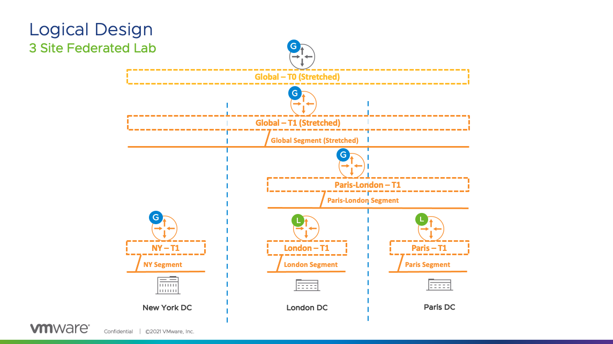

# NSX-T Federation Lab

PowerCLI and Terraform scripts to deploy a nested, fully configured NSX-T lab for Federation

## Overview

Creates a NSX-T Federated environment with 3 Sites. Each site contains:
- 1 vCenter
- 1 NSX Manager
- 1 Edge
- 2 ESXi hosts
    - 1 VM in each host

A Global Manager managing the sites is also deployed

## Usage
Edit the configuration-federation-lab.ps1 with appropriate variables

```
PS /home/user> ./configure-federation-lab.ps1
```

## Lab Design


## Logical Objects

